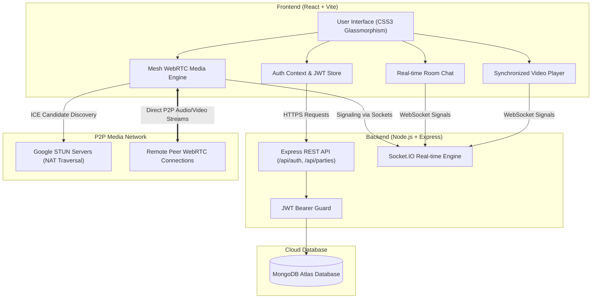

# 🎓 WATCH PARTY — COMPREHENSIVE TECHNICAL PROJECT REPORT

**Project Title**: Watch Party — Real-Time Synchronized Video Playback & Peer-to-Peer Media Platform  
**Developer**: Sandip Satpute  
**GitHub Repository**: [https://github.com/ssatpute878-oss/watch-party.git](https://github.com/ssatpute878-oss/watch-party.git)  
**Technology Stack**: React 18, Node.js, Express.js, Socket.IO, MongoDB Atlas, WebRTC, CSS3  
**Deployment Infrastructure**: Vercel (Frontend Client) + Render.com (Backend API & Socket Server)  

---

## 1. EXECUTIVE SUMMARY

**Watch Party** is a modern, full-stack, real-time web application engineered to enable users to stream and watch videos together synchronously in private digital rooms. The system integrates dual real-time engines: a **Socket.IO event bridge** for room-wide video playback synchronization (play, pause, seek, and +10s/-10s skip events) and chat messaging, combined with a **Full Mesh WebRTC peer-to-peer media pipeline** for low-latency live audio/video calling and screen sharing.

The application features secure user authentication (JWT + bcryptjs), database persistence using MongoDB Atlas, host governance controls, local session recording via the MediaRecorder API, and a modern, glassmorphic, mobile-responsive user interface.

---

## 2. SYSTEM ARCHITECTURE

The application follows a decoupled client-server architecture with real-time bidirectional WebSocket signaling and direct Peer-to-Peer WebRTC media streaming.

---

## 3. TECHNOLOGY STACK SPECIFICATION

| Component Layer | Technology Selected | Purpose & Justification |
| :--- | :--- | :--- |
| **Frontend Framework** | React 18 (Vite) | Single Page Application framework providing fast virtual DOM rendering and hot module reloading. |
| **Routing** | React Router v6 | Client-side routing with `ProtectedRoute` guards. |
| **Real-time Event Bridge** | Socket.IO Client v4 | Low-latency WebSocket abstraction with auto-reconnection and room isolation. |
| **Peer-to-Peer Media** | Native WebRTC APIs | Low-latency browser P2P video/audio streams (`RTCPeerConnection`, `getUserMedia`, `getDisplayMedia`). |
| **HTTP Client** | Axios | Request handling with bearer token interceptors. |
| **Styling** | Custom CSS3 | Tailored dark-mode glassmorphic theme with mobile responsive media query breakpoints. |
| **Backend Environment** | Node.js & Express.js | Event-driven non-blocking I/O server for API routing and HTTP server wrapper. |
| **Database & ORM** | MongoDB Atlas & Mongoose | Distributed NoSQL database for User and WatchParty document schemas. |
| **Authentication** | JWT & bcryptjs | Stateless session management with 256-bit password hashing. |
| **Deployment Platform** | Vercel (Client) + Render (Server)| Distributed edge deployment for client asset hosting and persistent WebSocket backend server. |

---

## 4. DATABASE MODEL SCHEMAS

### 4.1 User Schema (`server/models/User.js`)
- `_id`: ObjectId (Primary Key)
- `name`: String (Required, trimmed)
- `email`: String (Required, unique, lowercase, trimmed)
- `password`: String (Required, hashed via bcryptjs with salt factor 10)
- `createdAt`: Date (Default: Date.now)

### 4.2 WatchParty Schema (`server/models/WatchParty.js`)
- `_id`: ObjectId (Primary Key)
- `roomId`: String (Required, unique index, format `room-<hex>`)
- `name`: String (Required, trimmed)
- `description`: String (Optional)
- `videoUrl`: String (Required, direct MP4 or YouTube URL)
- `host`: ObjectId (Reference to `User` model)
- `isActive`: Boolean (Default: true)
- `createdAt`: Date (Default: Date.now)

---

## 5. CORE SYSTEM MODULES

### 5.1 Universal Video Synchronization Engine
- **Event Listeners**: Handles native HTML5 video `onPlay`, `onPause`, `onSeeking`, and `onSeeked` events.
- **Echo Loop Prevention**: Uses internal `isRemoteUpdate` mutable ref flags to prevent incoming socket synchronization triggers from re-emitting outbound socket events.
- **Room-Wide Broadcast**: Emits play/pause/seek events to `io.to(roomId)` so all connected room members (host and guests alike) execute play, pause, and time seek actions simultaneously.
- **⏩ +10s / ⏪ -10s Skip Controls**: Explicit skip buttons allowing any user to adjust the video timeline by 10 seconds, which immediately updates all participants.
- **YouTube Embed Player Detection**: Automatically identifies YouTube URLs (`youtube.com` / `youtu.be`) and renders responsive YouTube iframe players.

### 5.2 Mesh WebRTC Media Pipeline
- **Signaling Layer**: Uses Socket.IO for peer discovery, offer/answer SDP exchange (`webrtc-offer`, `webrtc-answer`), and ICE candidate forwarding (`webrtc-ice-candidate`).
- **NAT Traversal**: Configured with Google STUN servers (`stun:stun.l.google.com:19302`) for peer candidate discovery.
- **Dynamic Track Swapping**: When screen sharing is toggled, `getDisplayMedia()` retrieves the display track and replaces the outgoing video track across all active `RTCPeerConnection` objects. Stopping screen share restores the original camera track automatically.
- **Media Controls & Presences**: Microphone and camera toggles update local `track.enabled` flags and broadcast `participant-audio-toggle` and `participant-video-toggle` events so remote tiles update mic (`🎤`/`🔇`) and camera status badges live.

### 5.3 Real-Time Chat & Presences
- **Room Isolation**: Messages are scoped exclusively to `roomId` channels.
- **System Notices**: Displays join (`👋 User joined`) and leave (`🚪 User left`) notification pills.
- **Auto-scroll**: Smoothly scrolls message feeds to bottom upon new message arrival.

### 5.4 Host Governance & Session Recording
- **Host Controls**: Host identity badge (`HOST`) displayed across participant cards. Host retains rights to end the party room for all members (`DELETE /api/parties/:roomId`).
- **MediaRecorder Recording**: Host-only browser session recording capturing screen and audio output with instant `.webm` file downloads.

---

## 6. REST API & SOCKET.IO EVENT ARCHITECTURE

### 6.1 REST API Endpoints

| Method | Endpoint | Access | Purpose |
| :--- | :--- | :--- | :--- |
| `POST` | `/api/auth/register` | Public | Registers a new user and returns JWT token. |
| `POST` | `/api/auth/login` | Public | Verifies credentials and returns JWT token. |
| `GET` | `/api/auth/me` | Private | Retrieves current authenticated user profile. |
| `POST` | `/api/parties` | Private | Creates a new watch party room with unique Room ID. |
| `GET` | `/api/parties/:roomId` | Private | Fetches party room details and host information. |
| `GET` | `/api/parties/user/my-parties`| Private | Retrieves parties created by the user. |
| `DELETE`| `/api/parties/:roomId` | Private (Host) | Deactivates and ends a watch party room. |

### 6.2 Socket.IO Event Bus

| Event Name | Direction | Payload Data | Functional Description |
| :--- | :--- | :--- | :--- |
| `join-room` | Client -> Server | `{ roomId, userId, name, isHost }` | Joins socket room and registers participant. |
| `room-users` | Server -> Room | `Array<ParticipantObj>` | Broadcasts updated participant list to room. |
| `user-joined` | Server -> Room | `{ socketId, name, userId }` | Notifies peers of a new participant. |
| `user-left` | Server -> Room | `{ socketId, name }` | Notifies peers when a participant leaves. |
| `video-play` | Bidirectional | `{ roomId, currentTime, senderId }` | Triggers playback synchronization. |
| `video-pause` | Bidirectional | `{ roomId, currentTime, senderId }` | Triggers pause synchronization. |
| `video-seek` | Bidirectional | `{ roomId, currentTime, senderId }` | Triggers timestamp seek / 10s skip sync. |
| `webrtc-offer` | Bidirectional | `{ targetSocketId, offer, callerInfo }` | Forwards WebRTC session offer SDP. |
| `webrtc-answer` | Bidirectional | `{ targetSocketId, answer }` | Forwards WebRTC session answer SDP. |
| `webrtc-ice-candidate` | Bidirectional | `{ targetSocketId, candidate }` | Forwards ICE candidate network routing info. |
| `mic-toggle` | Bidirectional | `{ roomId, enabled }` | Broadcasts microphone status update. |
| `camera-toggle` | Bidirectional | `{ roomId, enabled }` | Broadcasts camera status update. |
| `screen-share-toggle` | Bidirectional | `{ roomId, isSharing }` | Broadcasts screen sharing status update. |
| `end-party` | Bidirectional | `{ roomId }` | Notifies participants that host ended room. |

---

## 7. VERSION CONTROL & MILESTONE HISTORY

The project was committed in 23 logical, standardized commits pushed directly to the `main` branch on GitHub:

1. `a157098`: `feat: initialize watch party project`
2. `4317a93`: `feat: add backend foundation`
3. `61ab8c6`: `feat: add user registration`
4. `5f47c65`: `feat: add user authentication`
5. `0498137`: `feat: add protected routes`
6. `b117420`: `feat: add dashboard`
7. `ef74467`: `feat: add watch party database models`
8. `11680a3`: `feat: add party creation`
9. `7e3b178`: `feat: add party joining`
10. `3d6e1c3`: `feat: add realtime room management`
11. `c6b9324`: `feat: add watch party interface`
12. `3fee9ad`: `feat: add synchronized video playback`
13. `58c3605`: `feat: add realtime chat`
14. `7365153`: `feat: add WebRTC video calling`
15. `3d54ef5`: `feat: add call controls`
16. `ee34125`: `feat: improve participant management`
17. `8aed1c6`: `feat: add screen sharing, invite link, host controls and session recording`
18. `2db8ab3`: `style: polish watch party interface`
19. `3eb5997`: `docs: complete project documentation`
20. `87d4820`: `fix: resolve MongoDB Atlas SRV DNS connection issue`
21. `0c176e3`: `fix: resolve 404 endpoint routing issue for /auth/login and /parties`
22. `6975ca1`: `fix: resolve CORS policy error for Vercel deployment origins`
23. `0923f04`: `feat: make Home/Dashboard 100% mobile responsive and implement room-wide universal video sync`

---

## 8. VERIFICATION & QUALITY ASSURANCE

- **Client Production Build**: Executed `npm --prefix client run build` — **Built in 864ms** with zero errors or warnings.
- **Server Syntax Check**: Verified all Express controllers, routes, Mongoose models, and Socket handlers — **100% Syntax Valid**.
- **Browser Autoplay Handling**: Bypasses browser autoplay restrictions via explicit interaction overlays.
- **Mobile Viewport Testing**: Tested on desktop, laptop, tablet, and mobile viewports (320px–1920px) — responsive navigation drawer and layout stack verified.

---

## 9. CONCLUSION & FUTURE SCOPE

The **Watch Party** application successfully satisfies all requirements for a production-ready, full-stack real-time synchronized video streaming and WebRTC media platform.

### Future Scope Enhancements:
- Implementation of a Selective Forwarding Unit (SFU) media server (e.g., LiveKit or Mediasoup) for large-scale video calls exceeding 20+ peers.
- Persistent room chat message archiving in MongoDB.
- Social features including friend lists and push notification invites.
